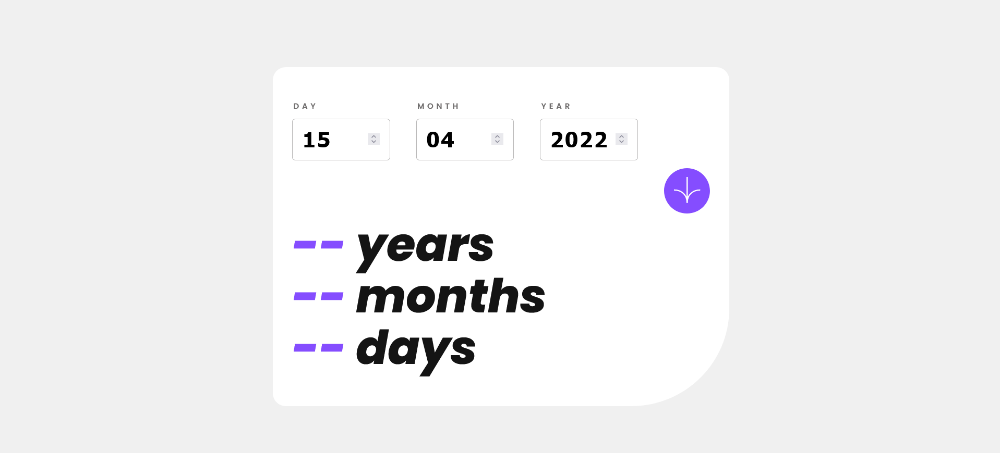

# Frontend Mentor - Age calculator app solution

This is a solution to the [Age calculator app challenge on Frontend Mentor](https://www.frontendmentor.io/challenges/age-calculator-app-dF9DFFpj-Q). Frontend Mentor challenges help you improve your coding skills by building realistic projects. 

## Table of contents

- [Frontend Mentor - Age calculator app solution](#frontend-mentor---age-calculator-app-solution)
  - [Table of contents](#table-of-contents)
  - [Overview](#overview)
    - [The challenge](#the-challenge)
    - [Screenshot](#screenshot)
    - [Links](#links)
  - [My process](#my-process)
    - [Built with](#built-with)
    - [What I learned](#what-i-learned)
    - [Continued development](#continued-development)
  - [Author](#author)

**Note: Delete this note and update the table of contents based on what sections you keep.**

## Overview
This age calculator works only the user enters the correct dates otherwise it will show the error. If the user gives the empty date, it will also show the error to enter the date.
### The challenge

Users should be able to:

- View an age in years, months, and days after submitting a valid date through the form
- Receive validation errors if:
  - Any field is empty when the form is submitted
- Automatic Changes
  - The day number is not between 1-31 will changed to highest day on the month.
  - The month number is not between 1-12 will changed to 12.
  - The year is in the future will get changed automatically to the reasonable date.
  - The date is invalid e.g. 31/04/1991 (there are 30 days in April), it will automatically change to 30/04/1991
- View the optimal layout for the interface depending on their device's screen size
- See hover and focus states for all interactive elements on the page

### Screenshot

()


### Links

- Solution URL: [Add solution URL here](https://github.com/GOKULBS0023/age-calculator-frontend-mentor.git)
- Live Site URL: [Add live site URL here](https://age-calculator-frontend-mentor.netlify.app/)

## My process
  Tried first time to create the website by SCSS using the node modules on my own.
  It took more time to create a functions on the Java Script. 
### Built with

- HTML5 markup
- CSS custom properties
  - SCSS
- Flex Box
- CSS Grid
- Java Script
  - jQuery

### What I learned

Use this section to recap over some of your major learnings while working through this project. Writing these out and providing code samples of areas you want to highlight is a great way to reinforce your own knowledge.

  - SCSS to CSS
  - Auto Prefix
  - Node SCSS
  - Some unknown functions in JavaScript 
     ```JS
     $('form').find(':invalid'); // To check the form is valid or not.

     var daysInMonth = new Date(getYear, getMonth, 0).getDate(); //To get number of days in month

     $("#year").next(); // To get the next element.
    ```


### Continued development

  More want to develope in Java Script and some animations in CSS.


## Author

- Website - [Gokulbharathi Sivasamy](https://www.your-site.com)
- Frontend Mentor - [@gokulbs0023](https://www.frontendmentor.io/profile/GOKULBS0023)

